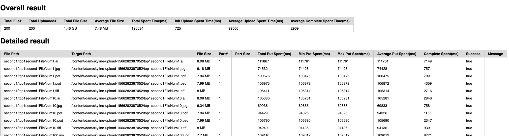

- [Background](#background)
- [Install](#install)
- [Usage](#usage)
- [Features](#features)
- [Todo](#todo)
- [Maintainers](#maintainers)

# Background

Unlike legacy AEM Assets, a single upload post request to createAsset servlet is enough for uploading files. Skyline uploading require sequence calls: init uploading to AEM to get cloud uploading presigned URL, uploading to cloud storage, them complete upload to AEM. Hence this tool is provided for making uploading easier.


# Install
This project uses [node](http://nodejs.org) and [npm](https://npmjs.com). Go check them out if you don't have them locally installed.

```sh
# 1. make sure login assets-skyline registry first for Adobe internal artifactory, use ldap as credential
$ npm login --scope=@assets-skyline --registry=https://artifactory.corp.adobe.com/artifactory/api/npm/npm-assets-skyline-release-local/

# 2. install, make sure the .npmrc is proper setup as above to root user as well
$ sudo npm install -g @assets-skyline/skyline-upload
```

# Usage
```sh
$ skyline-upload --help
Usage: skyline-upload [options] files&folder...

Options:
  --help            Show help                                          [boolean]
  --version         Show version number                                [boolean]
  -h, --host        Skyline host                [string] [default: "http://localhost:4502"]
  -c, --credential  Skyline credential          [string] [default: "admin:admin"]
  -t, --target      Skyline target folder       [string] [default: "/content/dam/skyline-upload-1566281417039"]
  -l, --log         Log file path               [string] [default: "upload-1566281417039.log"]
  -o, --output      Result html file path       [string] [default: "result-1566281417039.html"]
```

# Features
* Well tunning for take advantage of nodejs for best uploading performance
* Well formated json and html format performance result as below:


# Todo
* Recursive asset uploading for sub folders

# Maintainers
[@Jun Zhang](https://git.corp.adobe.com/zjun).
